# liri-node-app
## This is a command line node app that takes in parameters and gives you back data.
### LIRI Bot has four commands available:
* concert-this 'artist/band name here'
  - The concert-this command takes in an artist/band name and returns a list of upcoming concerts.
  - The results include the Venue, Location, and date.

    

    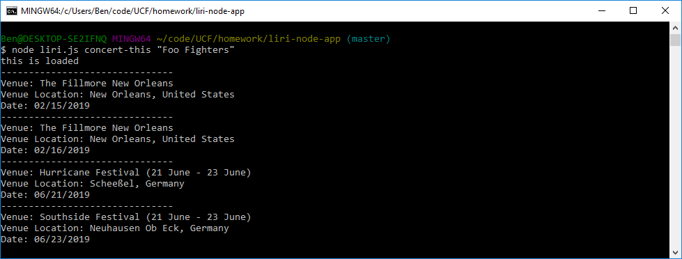

* spotify-this-song 'song name here'
  - The spotify-this-song command takes in a song name and returns the top result from spotify.
  - The result includes: Artist(s), Song Name, Preview Link, Album

    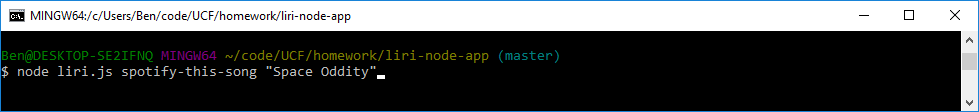

    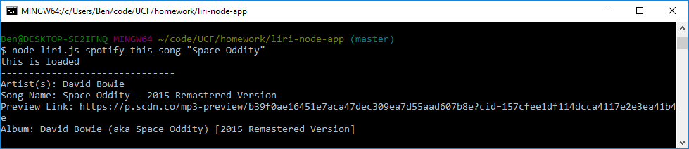

  - The spotify-this-song command defaults to 'The Sign' if a song is not given.

    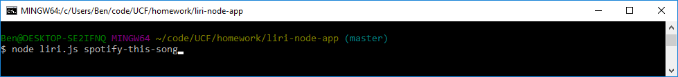

    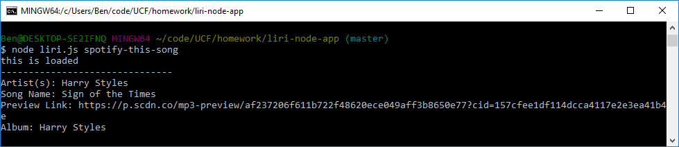

* movie-this 'movie name here'
  - The movie-this command takes in movie name and returns the top result from OMDB.
  - The result includes: Title, Ratings, Country, Language, Plot, and Actors.

    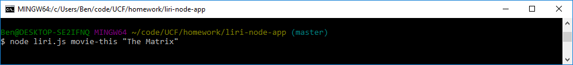

    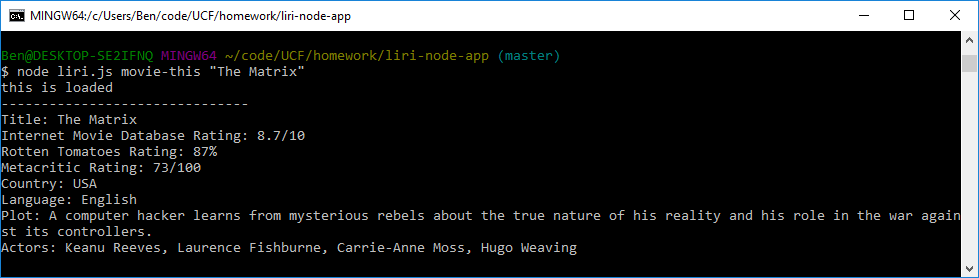

  - The movie-this command defaults to 'Mr. Nobody' if a movie is not given.
  
    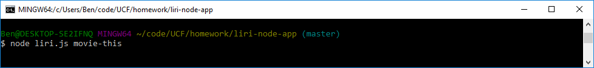

    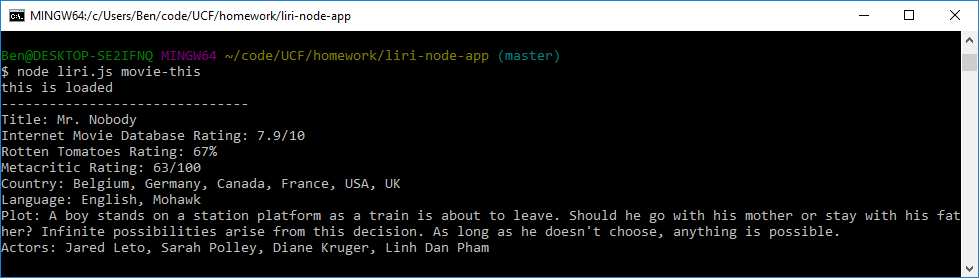

* do-what-it-says
  - The do-what-it-says command reads a random.txt file, and runs each command contained within.

    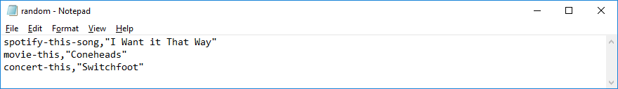

    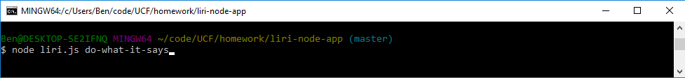

    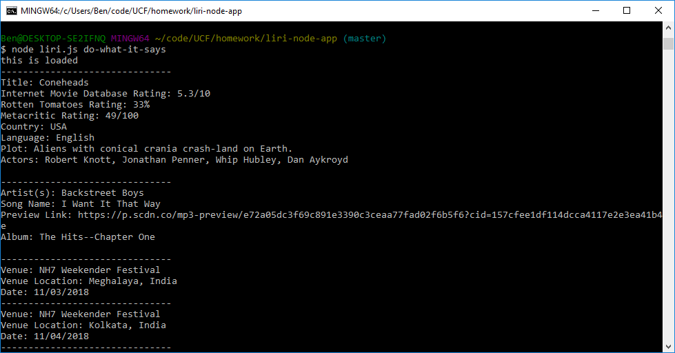

### LIRI Bot also outputs all commands and results in a log file.

  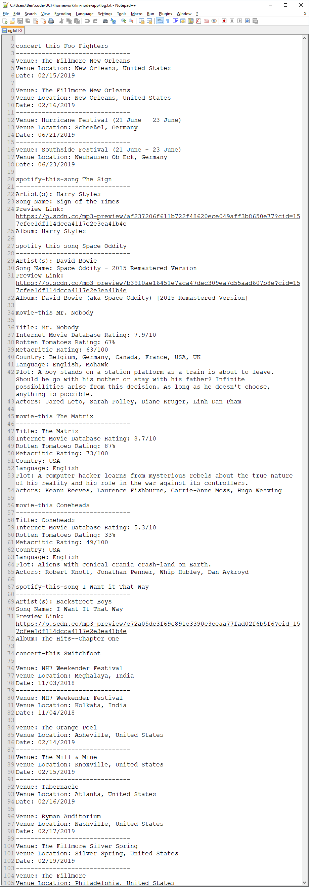

This project is meant to demonstrate our proficiency with node to create a command line app that uses node packages to retrieve data and output it.

### *Ben Houston designed and created this LIRI Bot for his coding bootcamp.*